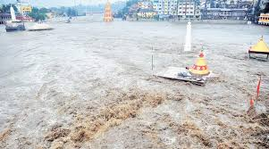
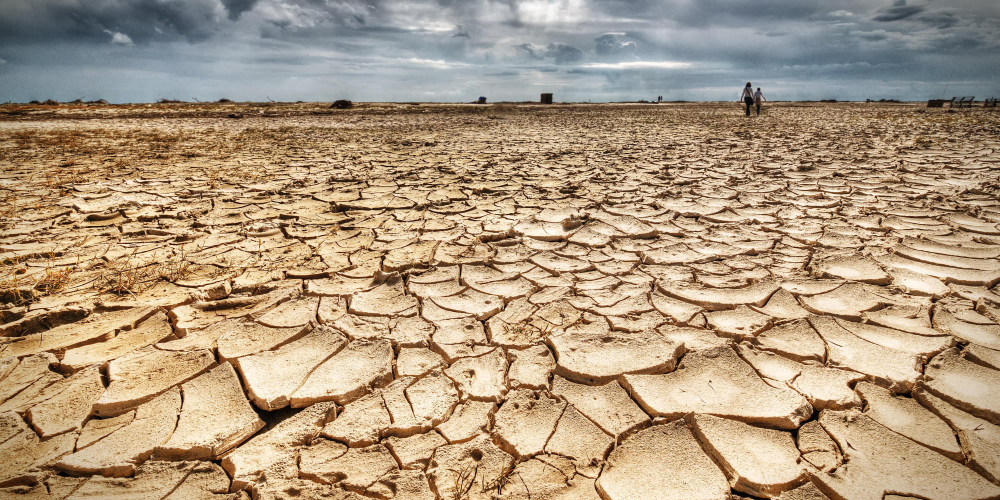

```{r setup, include=FALSE}
knitr::opts_chunk$set(echo = FALSE)
setwd("C:/boxsync/rthakar/Courses/Spring2017/ESM262/EnvInformatics")

library(doBy)
library (ggplot2)

clim_data <- read.table("clim.txt", header =TRUE)
clim_data$tmin <- as.numeric(clim_data$tmin)
clim_data$tmin <- as.numeric(clim_data$tmin)
clim_data$rain <- as.numeric(clim_data$rain)
clim_data$month <- as.factor(clim_data$month)

clim_data$avg_tmp <- (clim_data$tmin + clim_data$tmax)/2

avg_rain <- summaryBy(clim_data$rain ~ clim_data$year, FUN = mean, data = clim_data)
colnames (avg_rain) <- c("year", "avg_rain")

boxplot_rain <- ggplot (clim_data, aes (x = month, y = rain))+
  geom_boxplot()+
  theme_classic(base_size = 16)+
  labs(y = "Precipitation (Inches)", x = "Month")

boxplot_temp <- ggplot (clim_data, aes (x = month, y = avg_tmp))+
  geom_boxplot()+
  theme_classic(base_size = 16)+
  labs(y = "Average temperature (degree C)", x = "Month")

boxplot_annual_rain <- ggplot (avg_rain, aes (x =year, y = avg_rain))+
  geom_line()+
  theme_classic(base_size = 16)+
  labs(y = "Average Annual Precipitation (Inches)", x = "Month")

max <- which.maxn(avg_rain$avg_rain)
max_year <- avg_rain[max,1]

min <- which.minn(avg_rain$avg_rain)
min_year <- avg_rain[min,1]
```

## Precipitation by month

```{r}
boxplot_rain
```

## Temperature by month
Average monthly temperature is calculated as the average of minimum and maximum temperatures.
```{r}
boxplot_temp
```

## Wettest and driest years

```{r}
boxplot_annual_rain
```

Year of maximum precipitation i.e. wettest year is `r max_year` Year of minimum precipitation is `r min_year`.

## Visual representation of wet ecosystem



## Visual representation of wet ecosystem



## Seasonal variability

```{r, include = FALSE}
clim_data$month <- as.numeric(clim_data$month)

clim_data$season <- ifelse(clim_data$month %in% c(3,4,5),"Spring",
ifelse(clim_data$month %in% c(6,7,8), "Summer",
ifelse(clim_data$month %in% c(9,10,11), "Fall", "Winter")))

avg_rain_season <- summaryBy(clim_data$rain ~ clim_data$season, FUN = mean, data = clim_data)
colnames (avg_rain_season) <- c("season", "avg_rain_season")

seasonal <- ggplot (avg_rain_season, aes (x = season, y = avg_rain_season))+
  geom_col()+
  theme_classic(base_size = 16)+
  labs(y = "Average Seasonal Precipitation (Inches)", x = "Season")

max <- which.maxn(avg_rain_season$avg_rain_season)
max_season <- avg_rain_season[max,1]

min <- which.minn(avg_rain_season$avg_rain_season)
min_season <- avg_rain_season[min,1]
```

```{r}
seasonal
```

`r max_season` is the wettest season and `r min_season` is the driest season.

## Relationship between summer and winter

Average monthly values are calculated as mean of monthly observations over the number of years in clim.txt dataset.

```{r, include = FALSE}
clim_data$date <- as.Date (clim_data$date, format = "%m/%d/%y")

avg_monthly_rain <- summaryBy(clim_data$rain ~ clim_data$month, FUN = mean, data = clim_data)
colnames (avg_monthly_rain) <- c("month", "avg_monthly_rain")

avg_monthly_temp <- summaryBy(clim_data$avg_tmp ~ clim_data$month, FUN = mean, data = clim_data)
colnames (avg_monthly_temp) <- c("month", "avg_monthly_temp")

final_table <- data.frame (avg_monthly_rain, avg_monthly_temp)
final_table$month_name <- c("Jan", "Feb", "Mar", "April", "May", "June", "July", "Aug", "Sept", "Oct", "Nov", "Dec")

final_plot <- ggplot (final_table)+
  geom_point(aes(x = month, y = avg_monthly_temp), col = "blue")+
  geom_point(aes(x = month, y = avg_monthly_rain), col = "red")+
  theme_classic(base_size = 16)+
    theme(legend.position = "bottom")+
  labs(x = "Month", y = "Magnitude")+
  scale_x_discrete(name = "Month", labels = final_table$month)

```

```{r}
final_plot
```
Blue represents average monthly temperature and red represents average monthly rainfall. As seen from this graph, in summer months (month 5 to 8) temperature increases and in winter months (month 11 to 2), rainfall is high. This is explanatory of the location's water cycle  - water that evaporates in summer because of high temperature returns to the earth's surface reservoirs through rainfall in winter.

